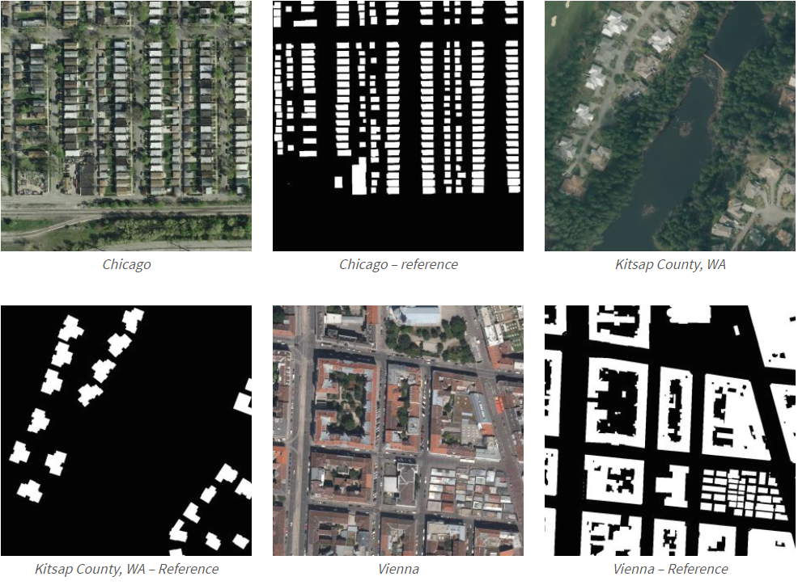

## Overview of Training Dataset Used

### Intro to the Dataset and Origins
In order to train the prospected model and to preview the code, I used the [Inria Aerial Image Labeling Dataset](https://project.inria.fr/aerialimagelabeling/files/). I became aware of the dataset from [Weijia Li's GitHub page](https://github.com/liweijia), the lead author of the [main research paper](https://www.mdpi.com/2072-4292/11/4/403/htm) I have used as guidance for this project. Her page outlined a series of datasets that were helpful for looking into data segmentation. I examined the list and came upon the Inria Aerial Image Labeling Dataset as being the most beneficial in my pursuits with the project because of how the dataset laid out the images and labels.  

### Content of the Dataset
The dataset is broken into training and testing data for analysis. The training data has ground truth images, illustrating the actgual segmentation of the buildings in the image. The areas that are classified as building are white pixels while the surrounding area is black, indicating a lack of buildings. This makes it so the problem is a strictly binary classification of building vs non-building, allowing for a more simplified classification task. The separation into training and testing datasets allows for validation of the model's results once it is trained. The training dataset contains satellite images from Austin, Chicago, Vienna, Tyrol, and Kitsap. The diversity of location provides images from varying environments for analysis. Because these areas have unique architecture such as Chicago's concentrated building layout compared to Vienna's spread out agricultural land, the model will be exposed to a myriad of environments. This will aid in the model's ability to predict houses in differing environments. That flexibility will help when predicting areas in Harrisonburg which can range from rural countryside to tight apartment housing. The images are .3 m resolution. The higher resolution of the images allows more detail in the outline of buildings, aiding the model in finding smaller differences between building and non-building. For a visual representation of the training data, view the image at the end of this page. 

### My Implementation of the Dataset
#### The Images I Used
In order to get the most benefit out of this dataset, I used strictly the training data. My reason for doing so is that these training data are the only images that have the accompanying labels. The testing data lacked these labels, making them unusable in the training data. Instead, I used the images in the training dataset and further split them. I used a 70-30 split on these images, placing 70% of the images in a variable for training the model and the other 30% into a variable for testing the accuracy of the model. This implementation ensured that I had labels to accompany each image I had, allowing me to assess the percent accuracy of the model I produce. 

#### Description of the Images and Preprocessing
The images in the dataset have the property of being 5000 x 5000 pixels in size. This means they are rather large in size. This resolution makes the images too large to be processed on their own in their original size. For this reason, I used a method in order to split these larger images into smaller fractions to then feed into the model. To do this, I used a python package called GDAL which I learned about from [this YouTube video](https://www.youtube.com/watch?v=H5uQ85VXttg) by the user _Making Sense Remotely_. In the video, she describes the process of importing images, determining the dimensions to split them into, and additional information surrounding the python package. I took the information and code from the video and adapted it to fit my research goals. Knowing the model requires image sizes divisible by 32, I divided each 5000 x 5000 image into 390 250 x 250 images. I then resized these images to be 256 x 256 in order to be divisible by 32. With the smaller size, I was then able to input these smaller images into the model to get results. I applied this preprocessing step to a series of images from the training dataset and then imported them into PyCharm to use with the model.

### A View of the Images and Labels

#### [Information about the Harrisonburg Dataset](hdataset.md)

#### [Home Page](README.md)