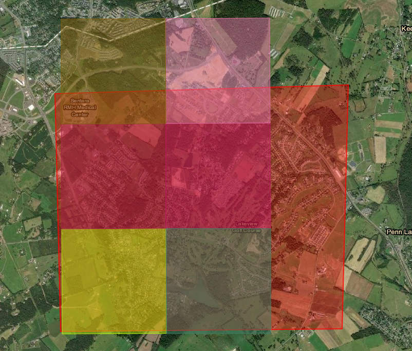

## Dataset for Harrisonburg, VA
### The Dataset
The dataset that I decided to use for Harrisonburg, VA comes from the [USGS Earth Explorer](https://earthexplorer.usgs.gov/). This website provides satellite images of varying types around the United States. The images that I selected to use for my project all come from the Harrisonburg Area and are .3 m resolution, the same as the training dataset that I used. This means that each image segment is the same 5000 x 5000 pixels, keeping consistency between the training dataset and Harrisonburg images I hope to use the model to predict on. The website allows users to mark an area on the map using coordinates and then download any images that are in that area. This allows for me to specifically pick the areas that I want to assess for this project, allowing much more freedom than I was initially expecting to have with a more traditional, pre-defined dataset. This flexibility and the format of the pictures make it so that the USGS data is a great fit for my goals with this project.

### Limitations
The dataset is not perfect and has some limitations. The first limitation is that some images have higher levels of cloud coverage than others. This means that the objects in the image may be covered up by clouds which can limit visibility. Luckily, the selection portal on the USGS website allows for the user to specify a level of cloud coverage that they want to see, ranging from 0% to 100%. This helps select images with less cloud coverage, but it is still possible that the image from a desired time period and area has too much cloud coverage. Additionally, the images from the dataset are older. The newest images in the Harrisonburg area are from 2011 and the next closest is 2007. This limitation is less impactful in my pursuit because I am trying to exhibit that the model can be used in this use case rather than have up-to-date results for now. Because of this limitation, I will be comparing images from 2002 to 2011 in order to see changes in housing structures rather than a newer time span. This near decade difference should still exhibit large changes in residential areas and provide some perspective on how much urbanization may have changed in the decade since the newest images. Once I am able to show the effectiveness of the model in this use case, I hope to one day find and potentially purchase newer images to have up-to-date understandings of urban changes and residential patterns. These two limitations do not stop the USGS dataset from being effective in my model and research but rather refocuses my approach to exhibit the success of the model and potential application for future use cases. 

### My Implementation
For my research purposes, I downloaded images from the Harrisonburg area outlined below. I downloaded the images from 2002 and 2011, labeling them as such to keep track of the time period. These time areas are near a decade apart and could show how dramatic of a shift in housing there was in the community and potentially predict changes in the decade from 2011. Once I had these images downloaded, I separated them into different folders. I applied the same preprocessing as I did on the training data. This time I split the larger 5000 x 5000 images into 100 500 x 500 images to provide more context on the area. To put these images into the model, I resized them to 512 x 512 because it is divisible by 32. This makes the images easier to provide as inputs to the model and for the model to predict on. I did this for each larger 5000 x 5000 image and placed them into folders designating the time period and the location of each. This preprocessing made the images ready for the model to predict on and provide results

### Example View of the USGS Interface
Below is a visual of what selecting the data from the USGS Earth Explorer website looks like. It allows you to select a given area you want to view, denoted by the larger red rectangle. In this area, you can choose images that cover a given area denoted by the different colored squares. Each square represents a 5000 x 5000 pixel area to be downloaded. I further split these images, but this graphic gives a clear overview of the process. You can interact with the Earth Explorer interface yourself [here](https://earthexplorer.usgs.gov/).

#### [Information about the Model](model.md)

#### [Home Page](README.md)