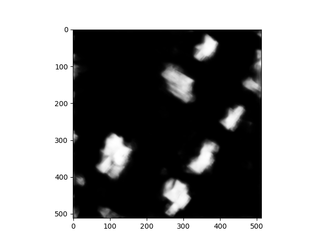

## Additional Comparisons 2002 vs 2011 Urbanization

Below are the generated masks for 2002 vs 2011. These masks come from the same area and can show the differences in the residential makeup of the areas from each time period. As I mentioned before, it appears that the 2011 masks have more noise or mis-classifications than the 2002 ones. This seems to be due to the extra cloud coverage the 2011 images have compared to the 2002 ones. That noise is evident in the third picture of 2011 where it misclassified a cul-desac road as a building. This is shown by the small circle in the middle of some houses. Additionally, the 2011 images overall have softer edges rather than clear defined edges like in the 2002 images. These drawbacks to the 2011 images do not stop them from being effective for comparison between the two time periods. These images can still exhibit large-scale residential changes in the area. 

| 2002 | 2011 |
| :----: | :----: |
|  |  |
|  |  |
|  |  |
|  |  |
|  |  |
|  |  |
|  |  |
|  |  |
|  |  |
|  |  |
|  |  |
|  |  |
|  |  |
|  |  | 
|  |  |

#### [Back to Results](results.md)

#### [Home Page](README.md)
