## Results of the U-Net Model
### Results on Training Data
As mentioned in the previous sections, I trained the U-Net model on the Inria Challenge dataset. I split those larger images into the smaller 250 x 250 format and then resized them further to fit into the model. I ultimately had 3,120 images that were 256 x 256 in size. I implemented the train test split and trained the model for a total of 15 epochs with a batch size of 32. I ran this model a handful of times with different numbers of epochs. The first couple of times I trained for 10 epochs and reached around 89% accuracy on the testing dataset. Once I upped the epochs to 15 I began getting better results into the mid 90s. The process of training for 15 epochs took around 5 hours for each run through. I trained a total of 5 times. Below are the results I gathered from my best training cycle and the accompanying loss graph for the duration of training:

| Train vs Test | Accuracy | Loss | 
| :-------------: | :--------: | :----: |
| Train | 96.65% | 0.0811 |
| Test | 94.61% | 0.1500 |

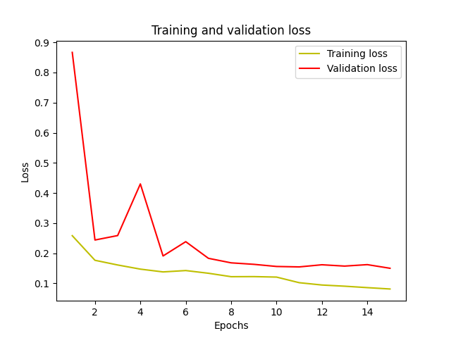

From the table, you can see that the model was able to reach a 96.65% accuracy on the training data and a 94.61% testing accuracy. For the training data, this means that the model correctly predicted the label of an individual pixel, building vs non-building, ~96% of the time. The same concept applies to the testing dataset. These results are promising given the variety exhibited in building architecture. In the dataset, most buildings had unique architecture that looked different depending on the area. For this reason, I was pleased with the final results of the model. To look beyond these base quantitative results I began to look at the images that the model was actually predicting. A sample of them is below.

#### Training Images and Masks

| Actual Image | Generated Mask | 
| :------------: | :--------------: | 
| 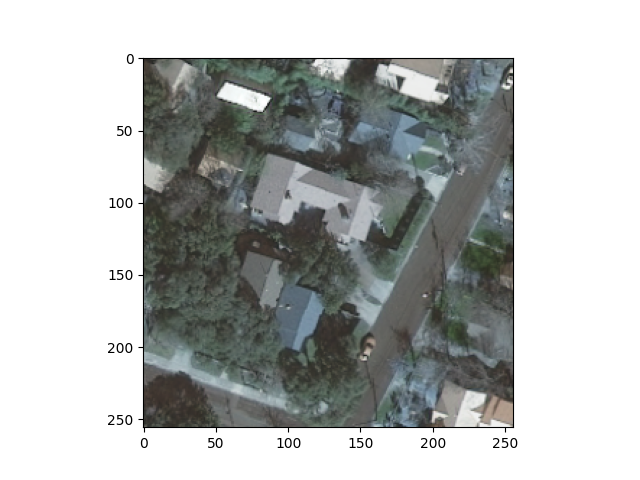 | 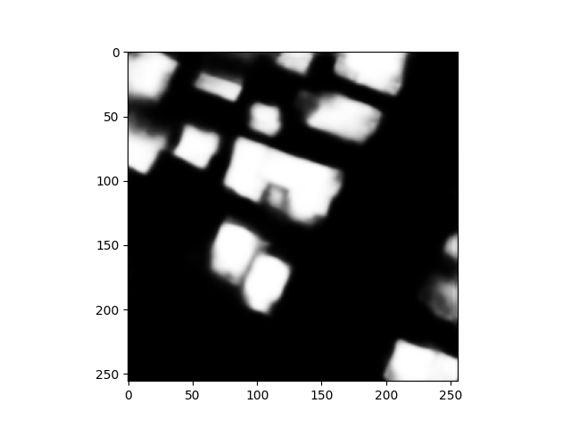|
| 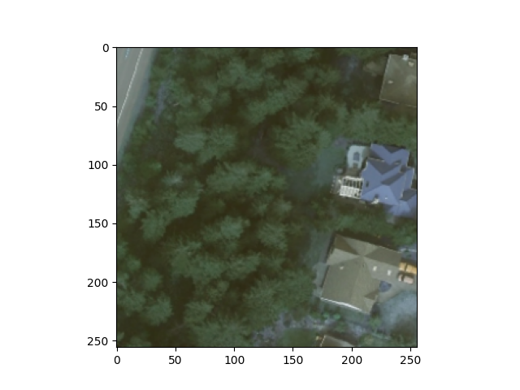 | 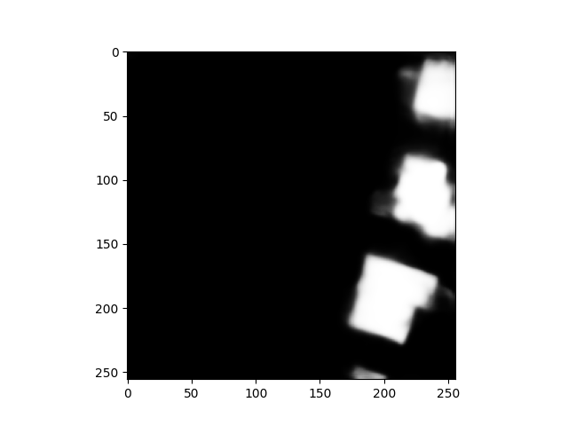 |
| 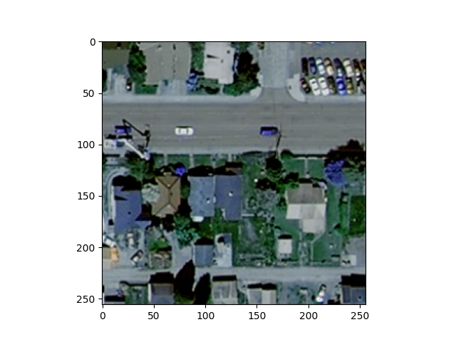 | 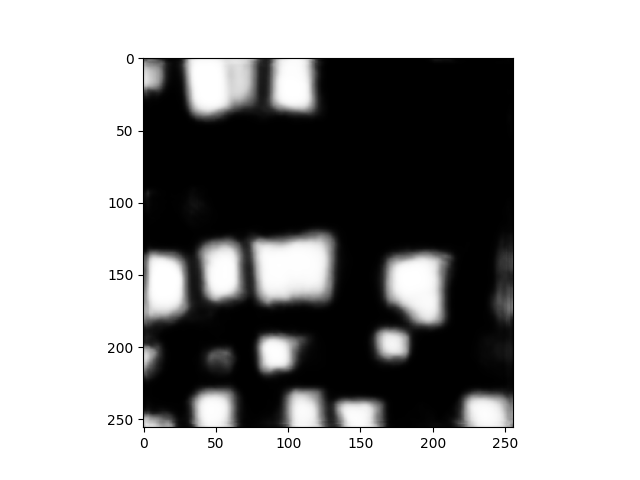 |
| 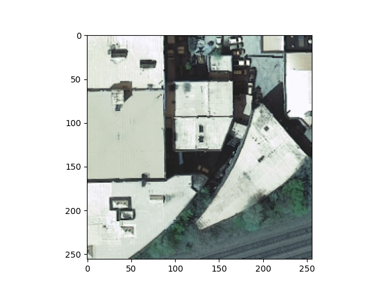 | 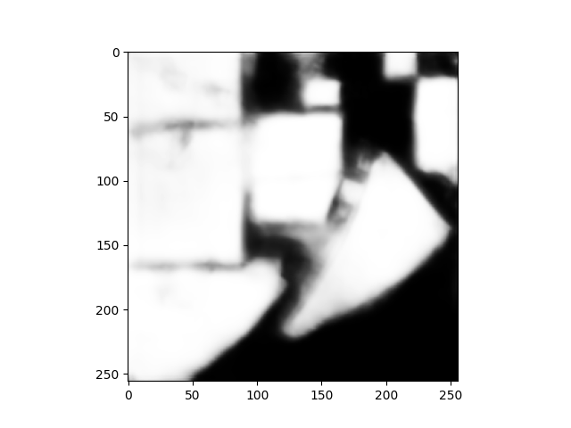 | 
| 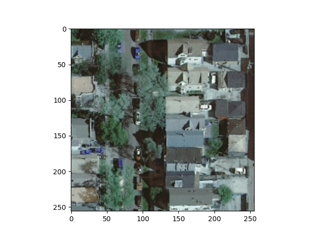 | 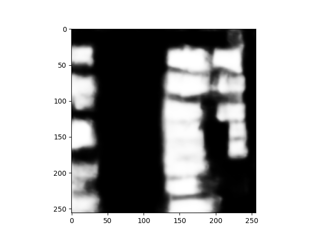 |

Above is a sample of the training images and the generated masks. On the left is the image that was provided to the model and on the right is the generated label. The black area is pixels labeled as being non-building. Contrarily, the white pixels are the areas classified as being building. The model does a good job of picking out these areas but sometimes lacks full definition. The 4th picture exhibits this well. There are some areas in between the two larger buildings where the model mistakenly labels the ground as being building. Additionally, there are some issues with defining buildings that are covered by trees or some shadows. Overall, these limitations do not halt the model from successfully illustrating areas where buildings are, especially on this training and testing data. These images provide reassurance that building segmentation using the U-Net model is not only possible but relatively effective. With this in mind, I moved on to applying this model to the images of Harrisonburg that I retrieved from the USGS Earth Explorer. 

### Results on Harrisonburg Images
Having the model work relatively well on the training set made me confident in its ability to then be applied to the Harrisonburg images I retrieved. To do so, I loaded the images in 9 different batches for each time period. Each batch had 100 500 x 500 images and covered a 5000 x 5000 pixel range. These images were resized to be 512 x 512 so they were compatible with the model. I then called the function model.predict() on the images, viewing the results with the im.show() command. Below are the results for 2002 and 2011 respectively.

#### 2002 Images

| Actual | Generated |
| :------: | :--------: | 
| 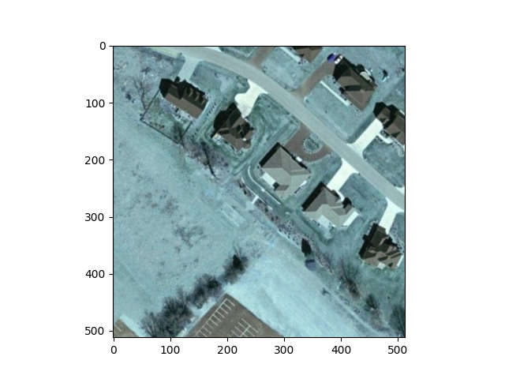 | 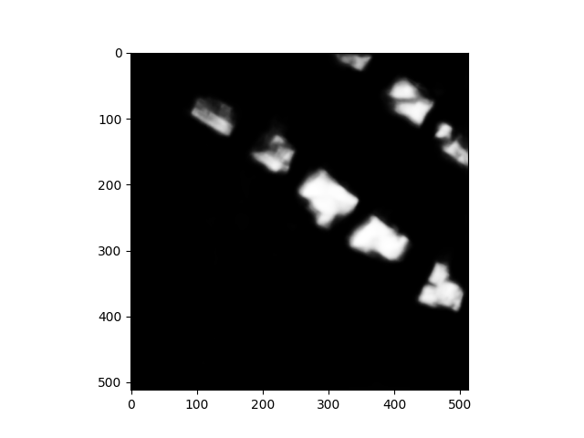 |
| 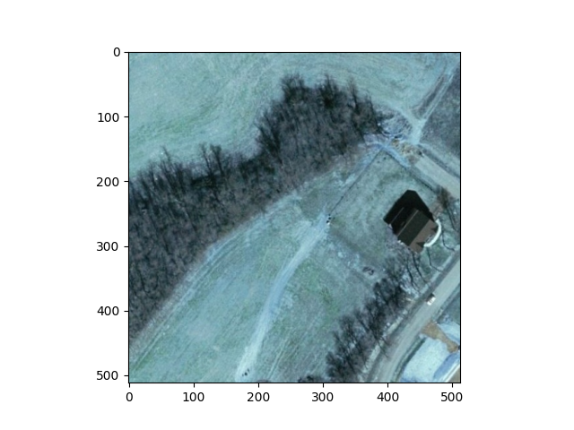 | 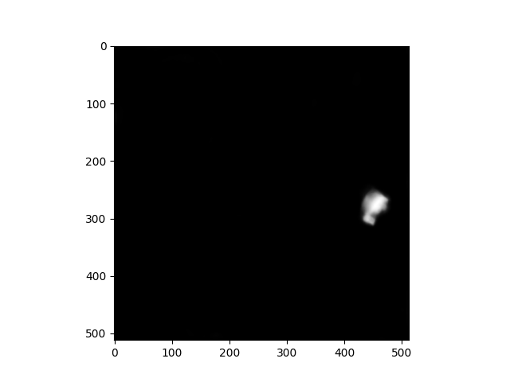 |
| 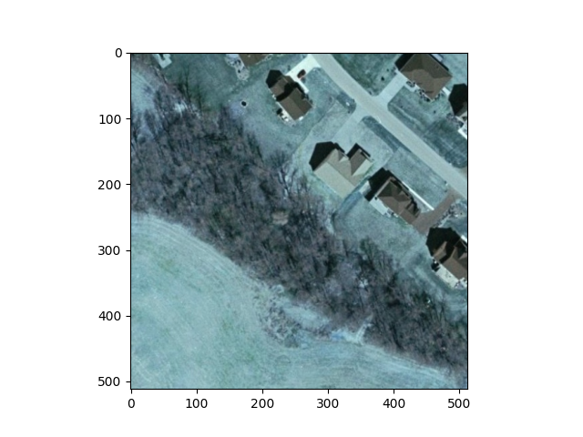 | 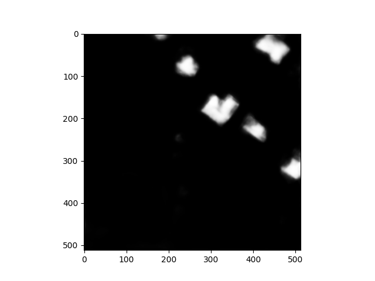 |
| 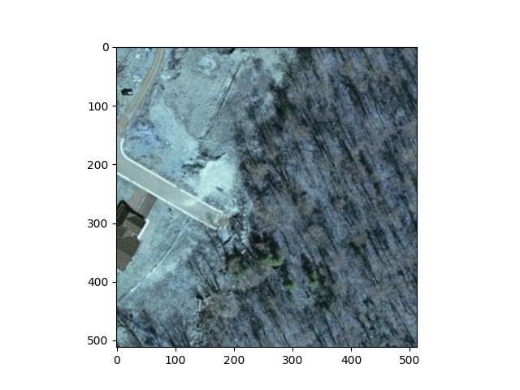 | 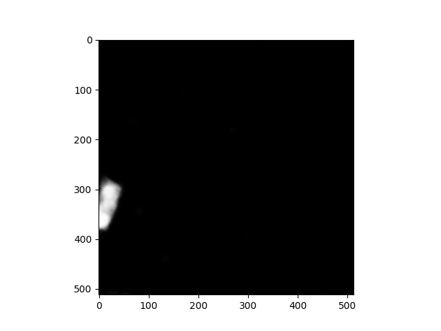 |
| 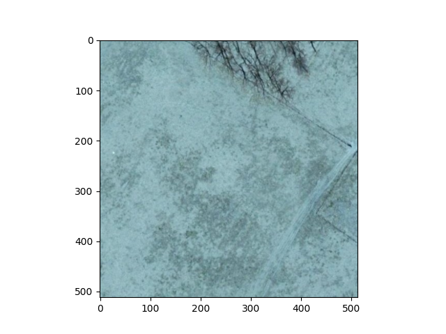 | 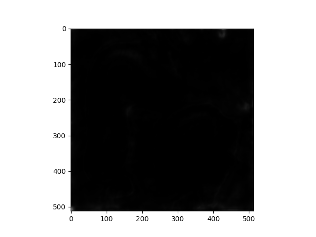 |

#### 2011 Images 

| Actual | Generated |
| :------: | :---------: | 
| 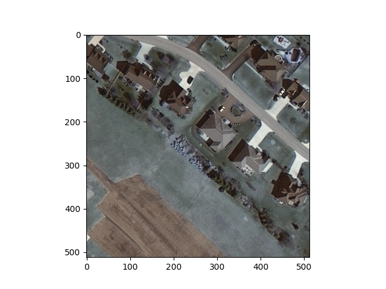 | 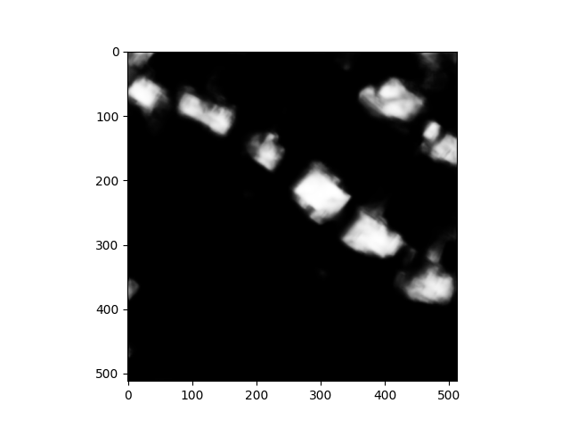 | 
| 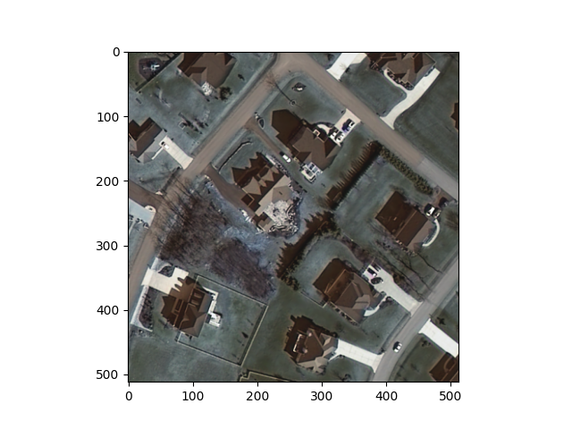 | 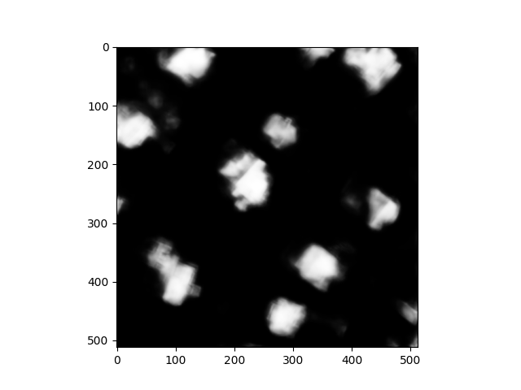 |
| 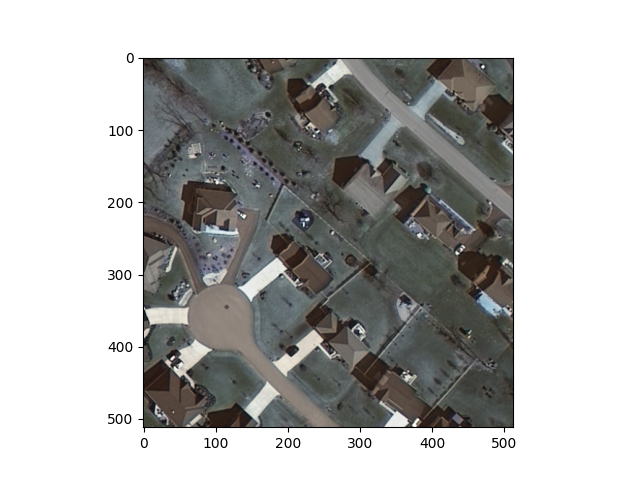 | 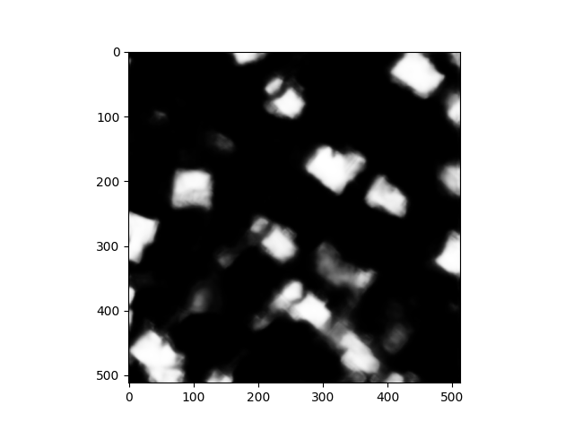 | 
| 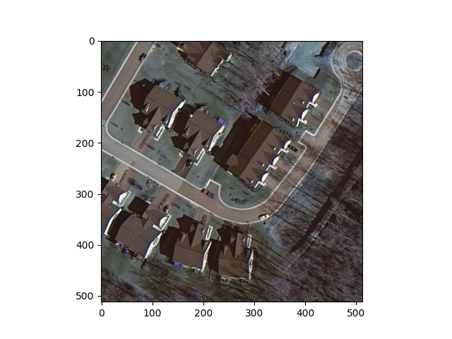 | 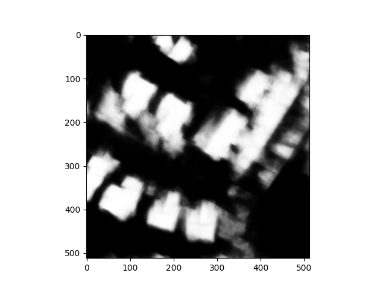 |
| 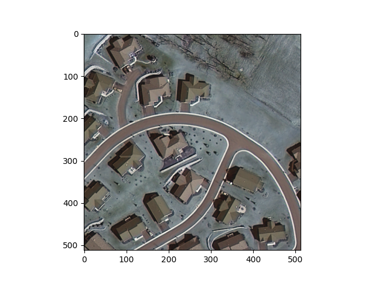 | 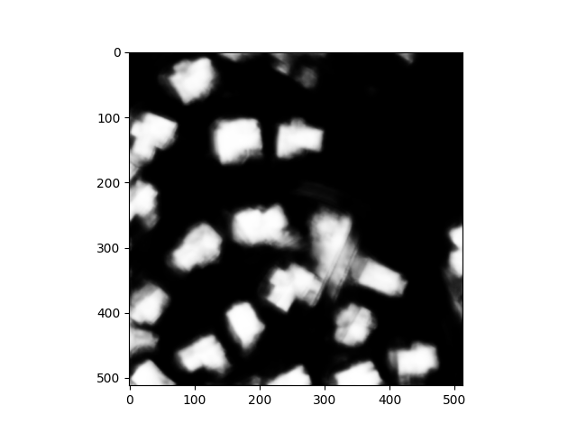 |

#### Assessment of Harrisonburg Results
The images above are the satellite images on the left and the generated mask on the right. I separated them by 2002 and 2011 but the images are from the same area. This means that the first image in the 2002 section is the same area as the 1st image in 2011 and so on. The model did an effective job on these Harrisonburg images but had similar faults as the training images. The borders can be blurry and fail to be fully defined at time. Additionally, there is sometimes extra noise when there are shadows, tree coverage, or clouds. These and more factors result in less accurate results for these images. Interestingly, the model seems to have a significant amount less noise on images from 2002. The 2002 predictions are very clear and don't appear to have noise outside where the buildings are. Contrarily, the predictions for 2011 have significantly more noise surrounding the buildings. This can make the images slightly harder to interpret. My guess for why this discrepancy occurs is that the 2011 images had much more cloud coverage than the 2002 images before the preprocessing. As well, they appear to have more shadows as a result of dead trees which could enhance the visible noise. The noise in the 2011 images does not fully detract from the usefulness of the images. Overall, the results are satisfactory and paint a decent picture of the residential makeup of any given area. 

#### Assessment of Urban Change
The most striking visual is the differences in the masks for the second image for both. There are a total of 9 buildings in 2011 compared to just 1 in 2002. These images demonstrate a dramatic increase in residential density for this area. Additionally, these results depict the development of entirely new neighborhoods, specifically in the 5th image for both 2002 and 2011. In 2002, there were no buildings or infrastructure. By 2011 there was an entirely new neighborhood comprised of 18 buildings. These results show the usefulness of the model: being able to compare development through the generated masks. These images depict where urban or residential change has occurred by visually marking where buildings are. Side by side, these images can provide immediate visual aid as to where buildings have cropped up. The white on black depiction of where buildings are provides easier visual confirmation than the full RGB spectrum of the initial images. It helps to fully highlight that change in an easy to interpret manner. 

#### [View additional comparative images for 2002  vs 2011](images.md)

#### [Information about Future Goals](future.md)

#### [Home Page](README.md)