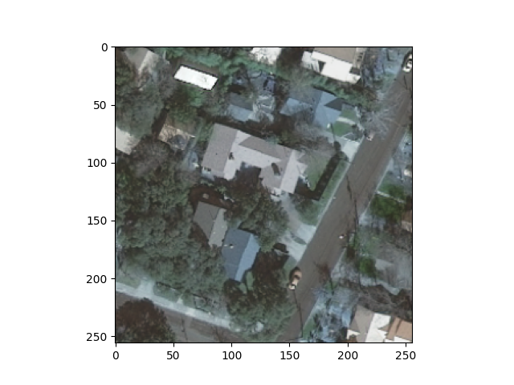
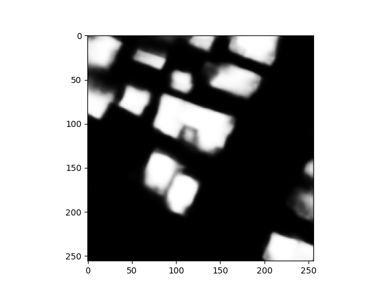
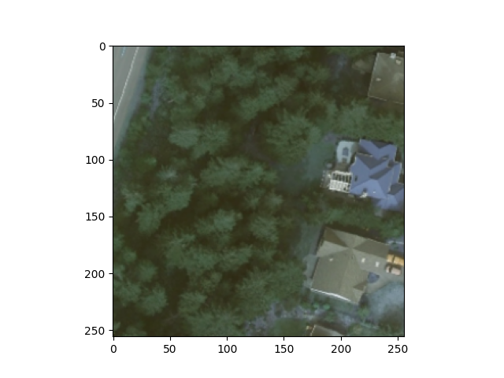
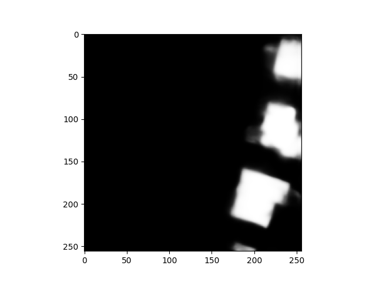
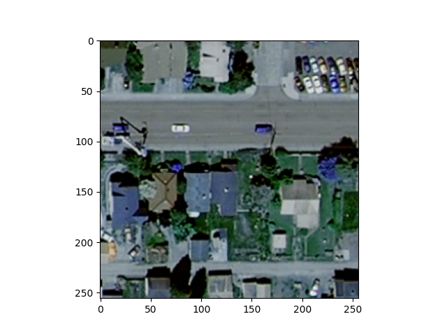
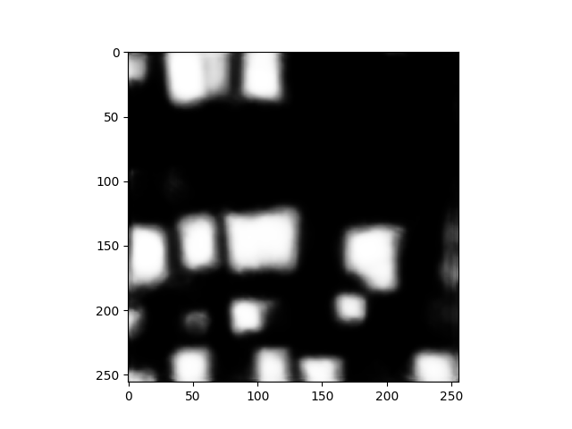
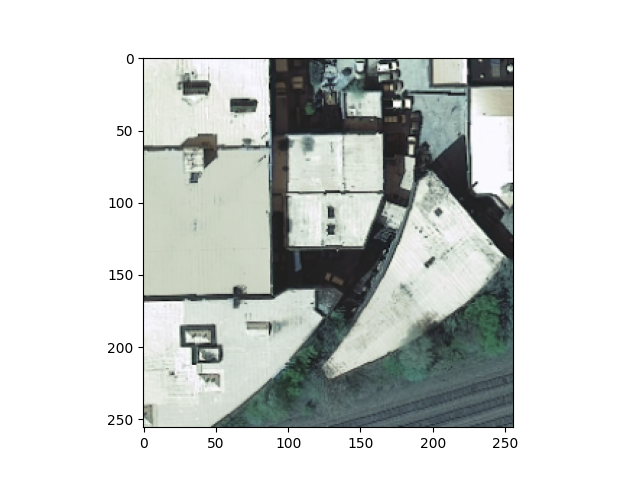
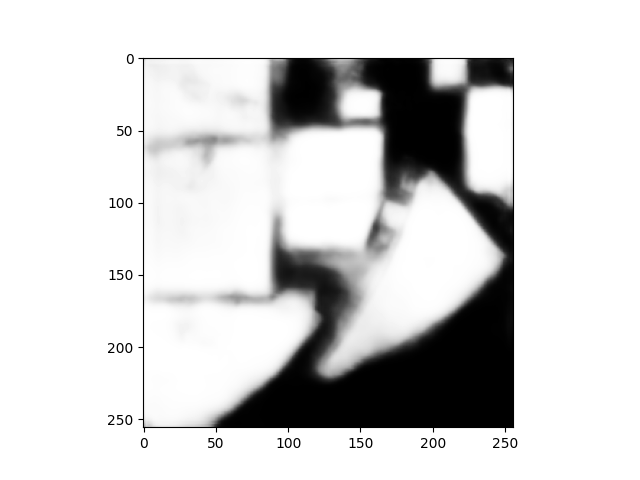
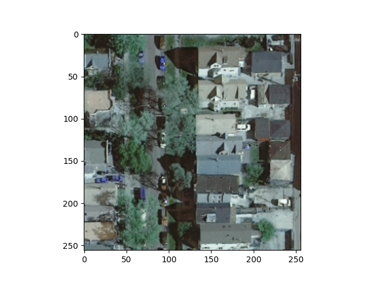
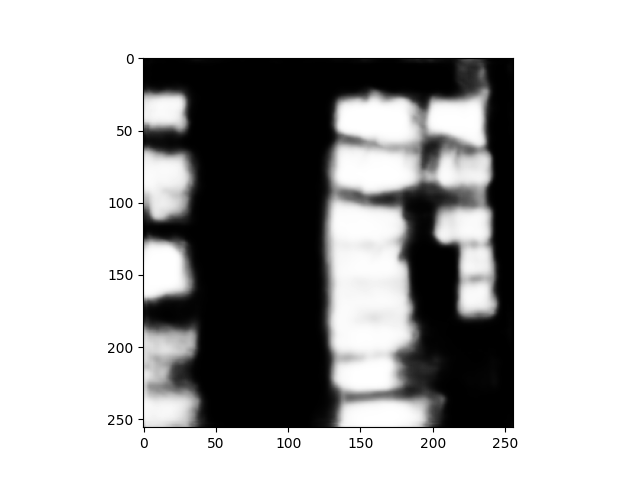

## Results of the UNet Model
### Results on Training Data
As mentioned in the previous sections, I trained the UNet model on the Inria Challenge dataset. I split those larger images into the smaller 250 x 250 format and then resized further to fit into the model. I ultimately had 3,120 images that were 256 x 256 in size. I implemented the train test split and trained the model for a total of 15 epochs with a batch size of 32. Here are the results I gathered and the loss graph for the duration of training:

| Train vs Test | Accuracy | Loss | 
| ------------- | -------- | ---- |
| Train | 96.65% | 0.0811 |
| Test | 94.61% | 0.1500 |

From the table you can see that the model was able to reach a 96.65% accuracy on the training data and a 94.61% testing accuracy. For the training data, this means that the model correctly predicted the label of an individual pixel, building vs non-building, ~96% of the time. The same concept applies to the testing dataset. These results are promising given the variety exhibited in architecture with most buildings not looking the same. For this reason I was reasonably pleased with the initial results of the model. To look beyond these base quantitative results I began to look at the images that the model was actually predicting. A sample of them is below.

| Actual Image | Generated Mask | 
| ------------ | -------------- | 
|  | |
|  |  |
|  |  |
|  |  | 
|  |  |

Above is a sample of the training images and the generated masks. On the left is the image that was provided to the model and on the right is the generated label. The black area is pixels labeled as being non-building. Contrarily, the white pixels are the areas classified as being building. The model does a good job of picking out these areas but sometimes lacks full definition. The 4th picture shows this. There is some areas in between the two larger buildings where the model mistakenly labels the ground as being building. Additionally, there are some issues with defining buildings that are covered by trees or some shadow. Overall, these limitations do not halt the model from successfully illustrating areas where buildings are, especially on this training and testing data. These images provide reassurance that building segmentation using the UNet model is not only possible, but relatively effect. With this in mind, I moved on to applying this model to the images of Harrisonburg that I retrieved from the USGS Earth Explorer. 
### Results on Harrisonburg Images

#### [Information about Future Goals](future.md)

#### [Home Page](README.md)